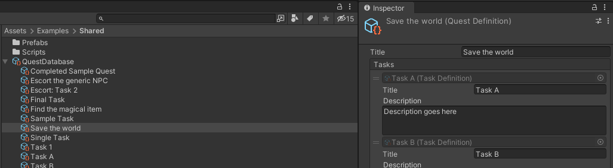
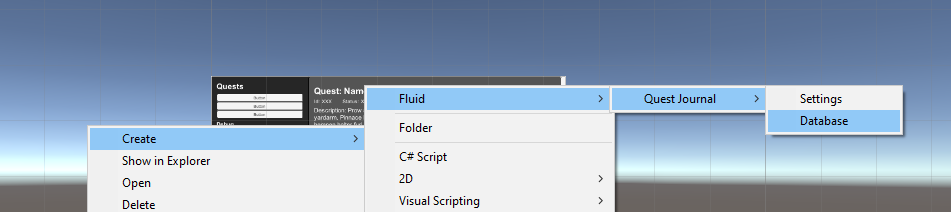
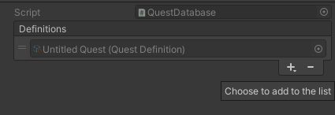
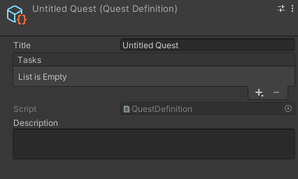
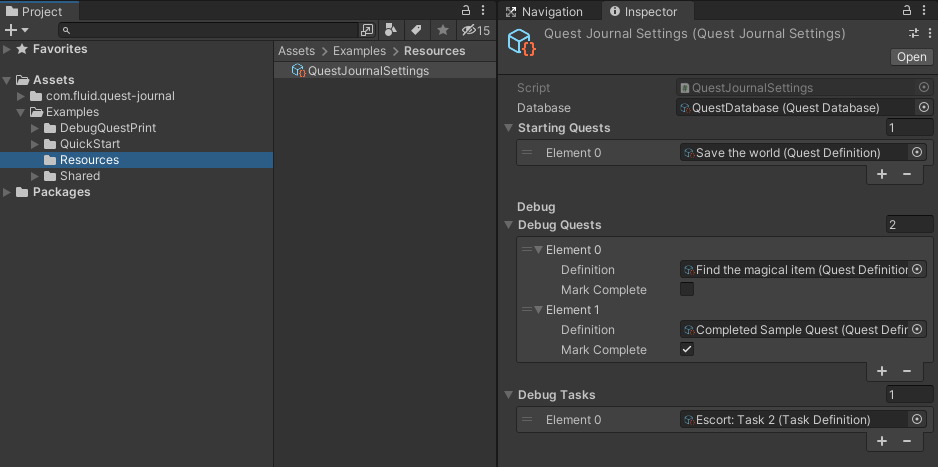
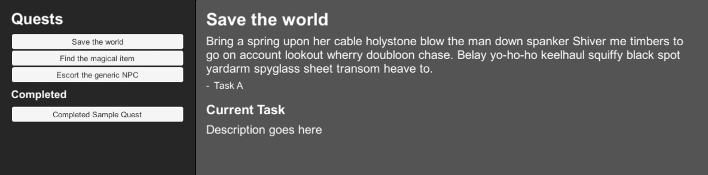
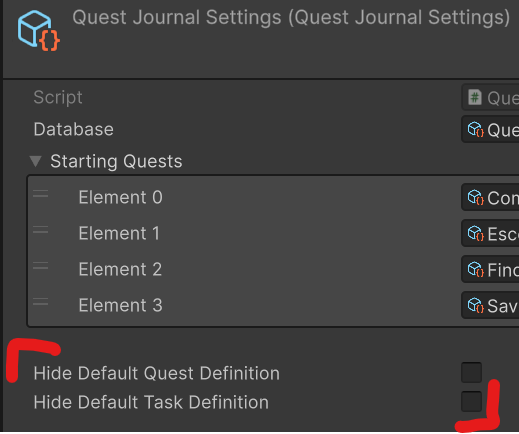

# Unity Quest Journal



A Unity 3D package for managing quests with sub-tasks. Inspired by Skyrim and The Witcher 3's task management systems.

**Features**

* Quests with support for task lists
* Quests and tasks as ScriptableObject(s) for easy reference in your inspectors
* Debug utilities to try out different quest/task combinations
* Customizable drop in example prefab to easily get a quest GUI up and running in minutes
* Save / load support out of the box
* Heavily tested with TDD
* Includes event hooks to distribute rewards, update UI, and other game logic

**Support**

Join the [Discord Community](https://discord.gg/8QHFfzn) if you have questions or need help.

See upcoming features and development progress on the [project board](https://github.com/ashblue/unity-quest-journal/projects/2).

## Getting Started

Unity Quest Journal is extremely easy to use. Here's a code sample that automatically updates a quest and prints out the status.

```c#
public class MyFirstQuest : MonoBehavior {
    private IQuestInstance _questInstance;
    public QuestDefinitionBase quest;
    
    void Start () {
        _questInstance = QuestJournalManager.Instance.Quests.Add(quest);
        
        // Prints Ongoing
        Debug.Log(_questInstance.Status);
    }
    
    public void NextTask () {
        _questInstance.Next();

        // Prints the current task name
        Debug.Log(_questInstace.ActiveTask.Title);
    }
}
```

### Installation

Unity Quest Journal is used through [Unity's Package Manager](https://docs.unity3d.com/Manual/CustomPackages.html). In order to use it you'll need to add the following lines to your `Packages/manifest.json` file. After that you'll be able to visually control what specific version of Unity Quest Journal you're using from the package manager window in Unity. This has to be done so your Unity editor can connect to NPM's package registry.

```json
{
  "scopedRegistries": [
    {
      "name": "NPM",
      "url": "https://registry.npmjs.org",
      "scopes": [
        "com.fluid"
      ]
    }
  ],
  "dependencies": {
    "com.fluid.quest-journal": "1.0.0"
  }
}
```

**Create A Database**

Next you'll need to create a database to put your quests and tasks in. You can do so by right clicking on the project window -> Create -> Fluid -> Quest Journal -> Database.



You can create a task by selecting the database and adding an item.



Double click the quest name to edit it. Here you can manage tasks and quest meta details.



**Configure Settings**

Next you'll need to create a Settings object. You can do this by right clicking on the project window -> Create -> Fluid -> Quest Journal -> Settings. This **must** be placed in a `Resources` folder and you can't change the name of the object (or it won't load correctly at runtime).

Make sure to attach your database we recently created to the settings object.



### Example Projects

To use any of the example projects, simply clone this scene and open the `Assets/Examples` folder in Unity.

**Quickstart Quest Menu**

Located at `Assets/Examples/QuickStart/QuestJournalQuickStart.scene`. The prefab used in this scene can be exported and dropped into any project to quickly setup a sample quest GUI for Unity Quest Journal. This can also act as a good boiler plate to write your own quest display.



To run this in your project simply instantiate the quick start prefab and it should automatically pull in all of your current quest data.

**Quest Debugging Scene**

Found in `Assets/Examples/DebugQuestPrint/DebugQuestPrint.scene`. A useful scene for debugging the quest editor. Prints out lots of meta data and has buttons to adjust quests at runtime. A great place to start if you're curious as to Unity how Quest Journal works under the hood.

## Recipes

### Event Hooks

You can hook into quest state changes with the following hooks. This is extremely useful for granting rewards, detecting task changes, updating UI, and other game logic.

NOTE: Make sure you remove the event listener when the listening object is destroyed to prevent memory leaks.

```c#
// Triggers when a quest is added to the collection. Generally useful for UI updates
QuestJournalManager.Instance.Quests.EventQuestAdd.AddListener((quest) => {
    // Your logic here
});

// Triggers when a quest is completed due to running out of tasks. Useful for quest completion post processing events
QuestJournalManager.Instance.Quests.EventQuestComplete.AddListener((quest) => {
    // Your logic here
});

// Triggered when a quest has a task change. A good place to update your UI if you are displaying quest progress
QuestJournalManager.Instance.Quests.EventQuestUpdate.AddListener((quest) => {
    // Your logic here
});

// Triggers whenever a task is completed with the corresponding quest and task instance. Useful to fire post processing events with completed tasks.
QuestJournalManager.Instance.Quests.EventQuestTaskComplete.AddListener((quest, task) => {
    // Your logic here
});
```

### Save And Load

Unity Quest Journal supports save and load functionality out of the box. You can execute a save of your current quest states as so.

```c#
string mySave = QuestJournalManager.Instance.Save();
```

To load the save simply run the following. Note that loading a save overwrites all present quest data.

```c#
QuestJournalManager.Instance.Load(mySave);
```

### Custom Quest Definitions

You can create your own quest definitions. This is useful for marking side quests, nav points, and other important details.

```c#
using CleverCrow.Fluid.QuestJournals;
using CleverCrow.Fluid.QuestJournals.Quests;

[CreateMenu("My Custom Quest")]
public class MyCustomQuestDefinition : QuestDefinitionBase  {
    public bool sideQuest;

    public void CustomMethodsGoHere () {
    }
}
```

In order to pull the custom definition at runtime you'll need to do a cast.

```c#
var definition = QuestJournalManager.Instance.Quests.Get(definitionTarget).Definition as MyCustomQuestDefinition;
```

### Custom Task Definitions

Tasks support custom definitions. This is a good place to include micro details about accomplishing a task (locations, exp, rewards, ect).

```c#
using CleverCrow.Fluid.QuestJournals;
using CleverCrow.Fluid.QuestJournals.Tasks;
using UnityEngine;

[CreateMenu("My Custom Task")]
public class MyCustomTaskDefinition : TaskDefinitionBase {
    public Vector3 waypointLocation;
    
    public void CustomMethodsGoHere () {
    }
}
```

Similar to custom quest definitions. You'll need to cast the Task definition to access it at runtime.

```c#
var taskDefinition = QuestJournalManager.Instance.Quests
    .Get(questDefinition)
    .ActiveTask
    .Definition as MyCustomTaskDefinition;
```

### Hiding Default Quest and Task

If you've written your own custom tasks you probably don't want the default ones to show up in the inspector. You can hide them by clicking the following checkboxes in your settings object.



## Releases

Archives of specific versions and release notes are available on the [releases page](https://github.com/ashblue/unity-quest-journal/releases).

## Nightly Builds

To access nightly builds of the `develop` branch that are package manager friendly, you'll need to manually edit your `Packages/manifest.json` as so. 

```json
{
    "dependencies": {
      "com.fluid.quest-journal": "https://github.com/ashblue/unity-quest-journal.git#nightly"
    }
}
```

Note that to get a newer nightly build you must delete this line and any related lock data in the manifest, let Unity rebuild, then add it back. As Unity locks the commit hash for Git urls as packages.

## Development Environment

If you wish to run the development environment you'll need to install the [Node.js](https://nodejs.org/en/) version in the [.nvmrc](.nvmrc) file. The easiest way to do this is install [NVM](https://github.com/nvm-sh/nvm) and run `nvm use`. 

Once you've installed Node.js, run the following from the root once.

`npm install`

If you wish to create a build run `npm run build` from the root and it will populate the `dist` folder.

### Making Commits

All commits should be made using [Commitizen](https://github.com/commitizen/cz-cli) (which is automatically installed when running `npm install`). Commits are automatically compiled to version numbers on release so this is very important. PRs that don't have Commitizen based commits will be rejected.

To make a commit type the following into a terminal from the root.

```bash
npm run commit
```

### How To Contribute

Please see the [CONTRIBUTIONS.md](CONTRIBUTING.md) file for full details on how to contribute to this project.

---

This project was generated with [Oyster Package Generator](https://github.com/ashblue/oyster-package-generator).
